# Smart Socket for Energy Efficiency ⚡

> **Hardware & Prototype Implementation**

An IoT-based smart electrical socket prototype designed for automatic power control, energy efficiency, overcharging prevention, status indication, and remote monitoring.

## 📌 Project Overview

The Smart Socket for Energy Efficiency is a smart electrical system developed to reduce unnecessary power consumption associated with idle chargers and continued charging after a device is fully charged.

The prototype combines an ESP32 microcontroller, current and voltage sensing, relay-based switching, temperature and humidity sensing, RGB status LEDs, and a Blynk IoT interface.

The system supports both manual and automatic operation, allowing users to control and monitor the socket remotely.

## 🎯 Objectives

- Reduce unnecessary standby and phantom power consumption.
- Automatically disconnect power from idle chargers.
- Prevent continued charging after a device reaches a fully charged condition.
- Enable remote ON/OFF control.
- Monitor voltage and current.
- Provide clear visual status indication.
- Improve safety through temperature monitoring and automatic control.

## ✨ Key Features

- Automatic power cut-off
- Idle charger detection
- Overcharging prevention
- Remote ON/OFF control
- Wi-Fi and Bluetooth connectivity
- Current and voltage monitoring
- Temperature monitoring
- RGB LED status indication
- Blynk IoT mobile interface
- Manual and automatic operating modes

## 🔧 Hardware Components

### ESP32 Microcontroller

The ESP32 acts as the central controller and manages communication between the sensors, relay, and IoT application.

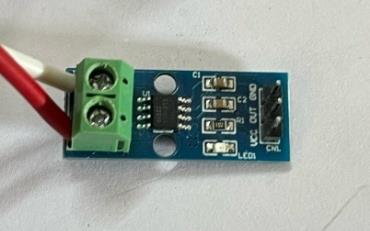

### Relay Module

A 10A/250V electromechanical relay is used as the switching mechanism to control power to the connected load.

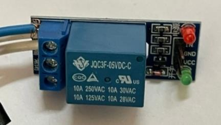

### ACS712 Current Sensor

The ACS712 Hall-effect current sensor is used to measure the current drawn by the connected load and help determine its charging condition.

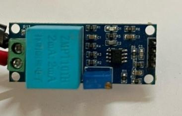

### ZMPT101B Voltage Sensor

The ZMPT101B voltage sensor is used to monitor AC voltage levels and support electrical parameter monitoring.

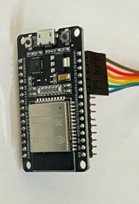

### TJA1050 CAN Bus Module

The TJA1050 module provides an interface for CAN-based communication.

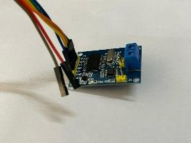

### DHT11 Sensor

The DHT11 sensor provides temperature and humidity measurements and supports the temperature-based protection strategy.

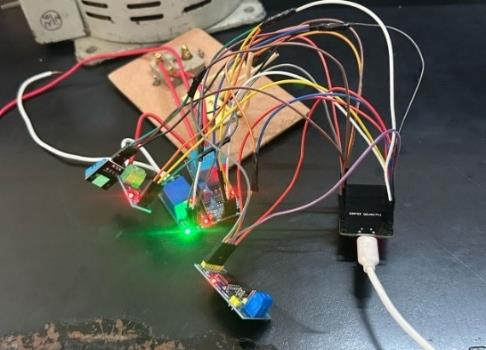

## 🔌 Hardware Connection

The connection diagram shows the interconnection between the ESP32, current sensor, voltage sensor, temperature sensor, relay, and associated circuitry.

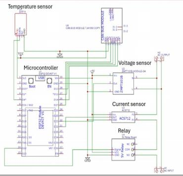

### Prototype Hardware Connection

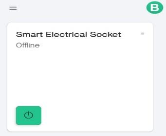

## ⚙️ Working Principle

### Automatic Mode

1. The system monitors the connected charger/load through the sensing circuitry.
2. If a charger is connected without an active device, the system waits for 15 seconds.
3. If the condition remains unchanged, the relay disconnects the power supply.
4. When a device is charging, the current sensor monitors the charging current.
5. When the current is above 0.5 A, the system identifies the charging condition and activates the blue LED.
6. When the current remains equal to or below 0.5 A for more than 10 seconds, the system considers charging complete.
7. The relay disconnects the power supply and the green LED indicates completion.

### Manual Mode

In manual mode, the user can control the socket directly through the Blynk mobile application.

The socket can be switched ON or OFF remotely according to the user's requirement.

## 📱 Blynk IoT Application

The system uses the Blynk IoT platform for remote monitoring and control.

The application provides:

- Remote ON/OFF control
- Manual and automatic modes
- Voltage monitoring
- Current monitoring
- Device status
- Charging status
- User notifications

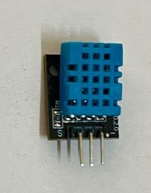

### Power ON

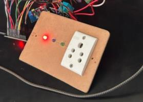

### Power OFF

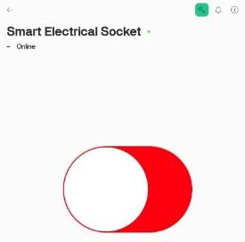

## 💡 LED Status Indication

| LED | Status |
|---|---|
| Red | Standby |
| Blue | Device Charging |
| Green | Fully Charged |

### Charging Mode

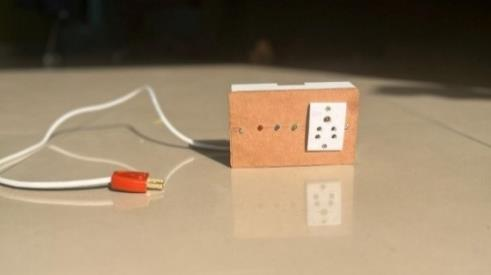

### Standby Mode

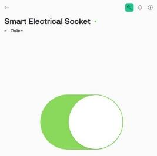

## 🧪 Final Prototype

The final prototype integrates the ESP32 controller, relay, sensors, status indicators, and electrical socket within a compact enclosure.

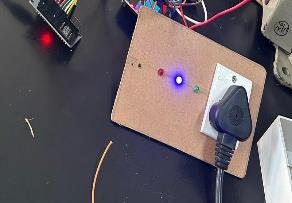

## 📊 Smart Socket vs Conventional Socket

| Feature | Conventional Socket | Smart Socket |
|---|---|---|
| Remote ON/OFF | No | Yes |
| Automatic Power Cut-off | No | Yes |
| Real-time Energy Monitoring | No | Yes |
| Wi-Fi & Bluetooth | No | Yes |
| Idle Charger Cut-off | No | Yes |
| Overcharging Protection | No | Yes |

## 📈 Reported Results

The associated research work reports that the smart socket can contribute to reducing unnecessary energy consumption and provides automatic power control, overcharging prevention, and remote monitoring.

The research paper reports an estimated contribution of around **30% energy savings**.

> **Note:** The research-paper results are presented for reference. This repository focuses on the hardware and prototype implementation contribution.

## 🚀 Applications

The concept can be applied to:

- Smart homes
- Smart charging systems
- Residential energy management
- Mobile charging stations
- Energy-efficient electrical outlets
- IoT-based power management

## 🔮 Future Scope

Potential improvements include:

- Machine-learning-based power optimization
- Integration with renewable energy sources
- Improved cybersecurity and encryption
- Advanced energy monitoring
- Enhanced smart-home integration

## 👨‍🔧 My Contribution

**Role: Hardware & Prototype Development**

My contribution to the project focused on the **hardware and prototype implementation**, including:

- Hardware assembly
- Component integration
- Circuit implementation
- Sensor and relay integration
- Prototype development
- Practical testing and validation

This repository documents the hardware/prototype work and does not claim authorship of the associated research paper.

## 📚 Related Research Work

The prototype is associated with the research work:

**"Smart Socket for Energy Efficiency"**

Published in the **2025 IEEE International Conference on Recent Advances in Computing and Systems (REACS)**.

DOI:

`10.1109/REACS67479.2025.11413567`

The research paper is referenced for technical background and system documentation.

## ⚠️ Safety Notice

This project involves AC mains voltage. Working with mains electricity can cause serious injury, electric shock, fire, or death.

Do not reproduce or modify the mains-side circuit without appropriate electrical safety knowledge, isolation, protection, supervision, and suitable testing equipment.

## 🛠️ Technologies & Concepts

`ESP32`  
`IoT`  
`Blynk IoT`  
`Sensors`  
`Relay Control`  
`Energy Efficiency`  
`Electrical Systems`  
`Embedded Hardware`  
`Automatic Power Control`

---
## 🏗️ System Architecture

```text
                    AC INPUT
                       │
                       ▼
              ┌─────────────────┐
              │   Power Supply  │
              └────────┬────────┘
                       │
                       ▼
              ┌─────────────────┐
              │      ESP32      │
              │  Microcontroller│
              └───────┬─────────┘
                      │
        ┌─────────────┼──────────────┐
        │             │              │
        ▼             ▼              ▼
   ACS712         ZMPT101B         DHT11
 Current Sensor  Voltage Sensor   Temp/Humidity
        │             │              │
        └─────────────┼──────────────┘
                      │
                      ▼
              ┌─────────────────┐
              │ Control Logic   │
              └────────┬────────┘
                       │
                       ▼
                 ┌──────────┐
                 │  Relay   │
                 └────┬─────┘
                      │
                      ▼
                AC SOCKET
                      │
                      ▼
                Charging Load

        ESP32 ←──── Wi-Fi / Bluetooth ────→
                    Blynk IoT App

**Project Type:** Academic Hardware Prototype  
**Focus:** Smart Energy Management & Electrical Hardware
